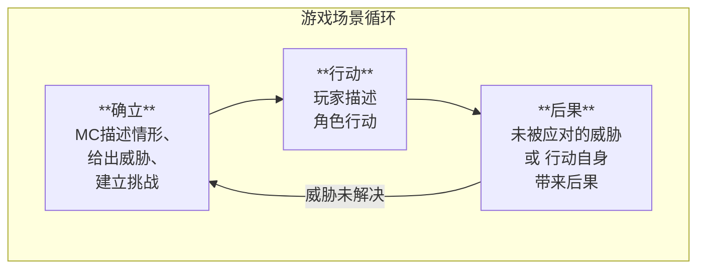
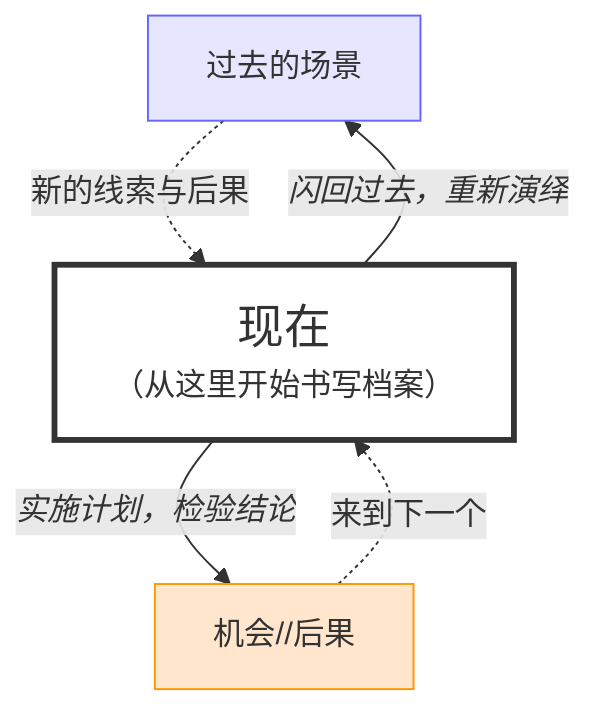

---
{"dg-publish":true,"permalink":"/TRPG规则/迷雾部-革新/1.核心引擎/"}
---

# 基础
## 标签
标签由简短而具体的描述构成，通常有1-3个词长，代表独立的特性或事物。
- **弱点标签**代表着一般情况下是缺陷或阻碍行动的事物与特质
- **故事标签**代表并不持久的事物，会因场景或形式的变化而消失
- **标签组**是若干互相联系的标签
## 主题
主题是代表某一侧面的**标签组**，其中，**主题标签**代表主题最核心的特质。
- 每个主题拥有3个初始的正面标签(包括1个主题标签在内)，以及1个弱点标签
	- 新生主题仅拥有1个主题标签与1个弱点标签
- 一般而言，主题拥有核心的**动机**，表述在这一侧面的追求
## 状态
状态含有描述与等级，代表着临时的状况或处境，以及其剧烈程度。
- 状态等级最低为1(最轻微)，最高为6(最剧烈)
- 相似的状态会累积，不同的状态会抵消
	- 状态的等级即是其最高等级
	- 累积状态时，将等级从低到高记录，累积等级若已被标记，则记在更高一级
	- 抵消状态时，从最高等级开始擦去对应数量的等级
## 极限
极限与特定的**状态**相关，代表事物或角色无法承受的状态等级。一旦对应状态的等级达到或超过极限，事物或角色就会被永久转变。
- 对于**挑战**，达到其极限就可以将之克服
- 玩家角色的极限为6，一旦达到，角色就将死亡或是被永久转变

## 挑战
在场景中，角色会面临各不相同的**威胁**。大部分威胁来自场景中的**挑战**。
- **挑战**一般而言会有不止一种极限，换言之，不止一种克服的方式
- 任何威胁着玩家行动的事物都可以是挑战，包括但不限于:
	- 敌人，陷阱，不利的社交情景
	- 诱惑，情绪，逐渐迫近的时刻

# 运行
## 行动
玩家需要**描述**角色如何行动，**掷骰**来决定行动是否成功，成功后兑现**效果**来影响场景。
-  一些行动只需要描述，有时还需要掷骰，当需要详细跟进时玩家才需要兑现效果
- **掷骰**:
	- 决定**效力**:
		- 每个可用的正面/弱点标签给予+1/-1效力
		- 最高等级的相关状态给予+/-等级效力
		- **燃尽**的正面标签改为给予+3效力
	- 构建**骰池**: 1D8+nD4(Kh)
		- 等同于效力的D4骰，所有D4中只取最高值加入掷骰结果
	- 检定**结果**:
		- 5及以下: 失败，且引发**后果**
		- 6-8: 成功，但伴随**后果**
		- 9及以上: 成功！
- **效果**:
	- 增加/减少状态等级: 1效力
	- 创建/移除**故事标签**: 2效力
	- 发现线索/额外举措: 1效力

> [!tip]- 特殊行动: 缓解
> 有时，你的行动或许并非完全出于主动，你可能想要应对某个后果而行动，躲过、抵御或化解袭来的危险。当你可以如此做时，MC会允许你执行一种被称为*缓解*的特殊行动。
> 缓解不会引发新的后果，所有的效力都将用于降低即将承受的状态。并且，在9+时，你可以从下选择一项:
> - 额外降低1级状态
> - 为自己或盟友创造一个1级的状态
{ #213d73}

> [!tip] *彻底浸入*
> 当你凝视深渊时，深渊也在凝视你。把正常的世界想象成湖岸边的世界，湖面以下则是所有那些未知的异常存在。如果这些东西爬上了岸，那你多少也得浸湿自己才能压制住祂们; 而如果祂们潜藏过深，却又太过危险呢?——你能做的，只有深吸一口气，然后扎入水中。
> 
> - 当你完全接纳自身的异常，并决定彻底重塑现实时，选择你将*彻底浸入*的浸染主题，并描述你如何运用这一主题潜在的巨大力量改变现实。MC将决定达成这一目的需要*浸没*、*深潜*还是*沉陷*，然后，你可以**掷骰**:
> 	- 每个你拥有的自我主题将给予+1效力
> 	- 不计算任何其他效力来源
> - 如果最终结果为:
> 	- 5及以下...
> 		- 你将承担6-8时的后果，并且，你的力量超脱了控制
> 	- 6-8...
> 		- *浸没*: 在所选择的主题上标记沉溺，并且，燃尽该主题的所有力量标签
> 		- *深潜*: 失去所选择的主题，并且，在随后替换为新的主题
> 		- *沉陷*: 直接承受一个6级状态
> 	- 9及以上...
> 		- *浸没*: 在所选择的主题上标记沉溺，并且，燃尽该主题内2个力量标签
> 		- *深潜*: 在所选择的主题上标记沉溺，并且，燃尽该主题的所有力量标签
> 		- *沉陷*: 失去所选择的主题，并且，在随后替换为新的主题
## 结构
### 场景循环
故事由**场景**组成，若干**场景**构成一次**任务**，若干**任务**共同构成一季**剧集**。
- 在一幕场景中，游戏会在**确立**-**行动**-**后果**中循环，直到威胁被解决，挑战被克服
	- **确立**时，MC会描述现在的情形，给出威胁，建立挑战
	- **行动**时，玩家可以描述角色会如何作为，尝试克服挑战
	- **后果**时，MC将兑现未处理的威胁引发的后果，或玩家的行动带来的后果
		- 角色也将有机会缓解后果，见[[#^213d73|缓解]]

### 任务结构
在一次**任务**中，游戏会切入***书写档案***的时刻，经历***演绎***与***检验***导向的数个场景，来到下一个书写档案，或在***检验***中成功压制异常。
- ***切入***: MC给出本次任务的调查小结, 叙述玩家需要处理的异常。玩家将在这时了解到他们的角色已经得到的线索。
	- 大部分的调查已经由玩家的角色完成，但玩家暂时只知道所获得的线索，并不确切知晓角色经历了什么。
- ***书写档案***: 角色们同处于安全处境，得以开始讨论。玩家可以通过***演绎***与***检验***的方式，逐渐解开谜团，完成任务。
	- ***演绎***: 玩家带着提出的结论，重新演绎过去调查的场景，确认结论的正确与否，从中发现新的线索。
	- ***检验***: 玩家提出新的猜想，开展行动对猜想进行验证，检验猜想的正确与否，寻找压制异常的机会。
		- 只有*检验*才可能出现让角色得以压制异常的*机会*，因此，书写档案必须在*检验*中结束。

#### 书写档案
当角色出于安全处境，玩家开始尝试解开谜团时，他们的角色即是在试图*书写档案*。这一般意味着玩家试图回答这些问题:
- 异常是什么?
- 异常有什么特性?
- 异常会造成什么危害?
- 什么让异常更具威胁?
- 如何才能压制异常?
- ......

 与[[#行动]]类似，回答时，玩家需要*叙述*自己的结论，检查与结论相关的线索:
- 每条能证明结论的线索将给予+1效力
	- 此外，能够证明结论的线索数量至少需要与谜团的复杂等级相当
- 每条与结论冲突的线索将给予-1效力

然后，选择一种书写档案的形式: 

> [!tip] # 演绎
> 演绎会导向一个过去的场景: 角色在那时收集到了相关线索，即将经历的事情足以揭示真相。
> 	**注意**: 演绎并非穿越时间。角色不能利用演绎后获得的知识或资源，也不可能改变已经明确发生过的事情。
> 
> 与MC一起构建这个场景，**描述**角色在做什么，然后开始**掷骰**:
> - 如果最终结果为...
> 	- 5及以下: 失败! 
> 		- 结论完全错误，因为发现了**一条足以反驳的线索**
> 		- **后果**随之浮现，演绎继续进行，直到可以导向现在的安全处境
> 	- 6-8: 混合成功。
> 		- 结论正确，并且可以作为进一步推理的线索
> 		- **后果**随之浮现，演绎继续进行，直到可以导向现在的安全处境
> 	- 9及以上: 成功!
> 		- 结论正确，并且可以作为进一步推理的线索

> [!tip] # 检验
> 检验是角色为了验证结论进行的实验: 凭借已经掌握的相关线索，角色现在开始行动，根据结果判断结论的正确与否。
> 	**注意**: 只有*检验*才可能出现让角色得以压制异常的*机会*，因此，书写档案必须在*检验*中结束。
> 
> 与MC一起构建这个场景，**描述**角色的计划是什么，然后开始**掷骰**:
> - 如果最终结果为...
> 	- 5及以下: 失败! 
> 		- 结论完全错误，因为发生了足以反驳结论的**后果**
> 		- 并且，这个后果会揭示一个额外的让异常更加棘手的特性
> 	- 6-8: 混合成功。
> 		- 结论正确，并且可以凭借这个*机会*直接应对异常
> 		- 但是，**后果**出现，并揭示一个额外的让异常更加棘手的特性
> 	- 9及以上: 成功!
> 		- 结论正确，并且可以凭借这个*机会*直接应对异常

